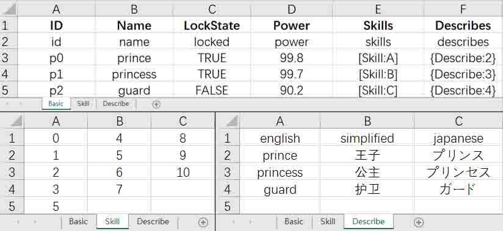

<!--
 * @Author: yunmin
 * @Email: 362279869@qq.com
 * @Date: 2022-10-09 18:20:51
-->
## How to use
1. Install [Nodejs](https://nodejs.org/) if not installed.      
2. Double-click the `start.bat` file or type `npm start` in terminal to start.        

## Config read/write path
1. Goto config(folder), then double-click the config.json file to edit.       
2. Double-click `start.bat` to run, then type: `-r your-read-path` or `-w your-write-path`       

## Export mode(array/object)   
<a href="./excels/template.xlsx"></a>


#### 1. Array export     
convert all: `-a`, convert specified files: `-a excel-filename1 excel-filename2`:
``` javescript      
[
  {
    id: 'p0',      
    name: 'prince',
    locked: true,  
    power: 99.8,
    skills: [ 0, 1, 2, 3, 5 ],
    describes: { english: 'prince', simplified: '王子', japanese: 'プリンス' }
  },
  {
    id: 'p1',
    name: 'princess',
    locked: true,
    power: 99.7,
    skills: [ 4, 5, 6, 7 ],
    describes: { english: 'princess', simplified: '公主', japanese: 'プリンセス' }
  },
  ...
]
```     
#### 2. Object export     
convert all: `-o`, convert specified files: `-o excel-filename1 excel-filename2`:
``` javescript   
{
  p0: {
    id: 'p0',
    name: 'prince',
    locked: true,
    power: 99.8,
    skills: [ 0, 1, 2, 3, 5 ],
    describes: { english: 'prince', simplified: '王子', japanese: 'プリンス' }
  },
  p1: {
    id: 'p1',
    name: 'princess',
    locked: true,
    power: 99.7,
    skills: [ 4, 5, 6, 7 ],
    describes: { english: 'princess', simplified: '公主', japanese: 'プリンセス' }
  },
  ...
}
```     
## Special configuration description      
1. `[SheetName:A]` represents an array field       
2. `{Describe:2}` represents an object field       
Browse `template.xlsx` in excels folder for detail     
 
